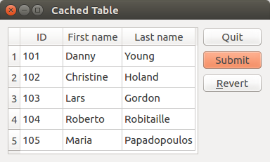

# introduction
1. summay of how to use QSqlRelationalTableModel
2. summay of how to suse TableModel 


# tables
* [employee]

| id* | name     | city  | county |
| --- | -------- | ----- | ------ |
| 1   | 'Espen'  | 5000  | 47     |
| 2   | 'Harald' | 80000 | 49     |
| 3   | 'Sam'    | 100   | 1      |

* [city]

| id*   | name       |
| ----- | ---------- |
| 100   | 'San Jose' |
| 5000  | 'Oslo'     |
| 80000 | 'Munich'   |

* [country]

| id* | name      |
| --- | --------- |
| 1   | 'USA'     |
| 47  | 'Norway'  |
| 49  | 'Germany' |

* [person]

| id* | first name  | last name      |
| --- | ----------- | -------------- |
| 101 | 'Danny'     | 'Young'        |
| 102 | 'Christine' | 'Holand'       |
| 103 | 'Lars'      | 'Gordon'       |
| 104 | 'Roberto'   | 'Robitaille'   |
| 105 | 'Maria'     | 'Papadopoulos' |


# [QSqlRelationalTableModel](https://github.com/pyqt/examples/blob/master/sql/relationaltablemodel.py)

## declaration

 * void QSqlRelationalTableModel::setRelation(int column, const QSqlRelation &relation)
 * QSqlRelation(const QString &tableName, const QString &indexColumn, const QString &displayColumn)

## set up the relation

```python
model = QSqlRelationalTableModel()
model.setTable("employee")
model.setRelation(2, QSqlRelation("city", "id", "name"))
model.setRelation(3, QSqlRelation("country", "id", "name"))
...
model.select()
```

## bind view with model

``` python
app = QApplication(sys.args)
view = QTableView()
view.setModel(model)
view.setItemDelegate(QSqlRelationalDelegate(view))
view.show()
```

# [QSqlTableModel](https://github.com/pyqt/examples/blob/master/sql/cachedtable.py)

## layout

```
Dialog.mainlayout --> QHBboxLayout
                        --> view: QTableView
                        --> bBox: QDialogButtonBox
                            --> quitButton:    QPushButton()
                            --> submmitButton: QPushButton()
                            --> revertButton:  QPushButton()
```


## construction

1. class TableEditor(QDialog)
2. TableEditor.model = QSqlTableModel()
3. TableEditor.view = QTableView()
4. TableEditor.view.setModel(TableEditor.model)


## view & model

 


