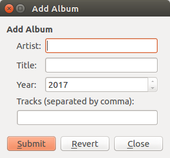

# introduction
1. summay of how to use QSqlRelationalTableModel
2. summay of how to suse TableModel 


# tables
* [employee]

| id* | name     | city  | county |
| --- | -------- | ----- | ------ |
| 1   | 'Espen'  | 5000  | 47     |
| 2   | 'Harald' | 80000 | 49     |
| 3   | 'Sam'    | 100   | 1      |

* [city]

| id*   | name       |
| ----- | ---------- |
| 100   | 'San Jose' |
| 5000  | 'Oslo'     |
| 80000 | 'Munich'   |

* [country]

| id* | name      |
| --- | --------- |
| 1   | 'USA'     |
| 47  | 'Norway'  |
| 49  | 'Germany' |

* [person]

| id* | first name  | last name      |
| --- | ----------- | -------------- |
| 101 | 'Danny'     | 'Young'        |
| 102 | 'Christine' | 'Holand'       |
| 103 | 'Lars'      | 'Gordon'       |
| 104 | 'Roberto'   | 'Robitaille'   |
| 105 | 'Maria'     | 'Papadopoulos' |

* [items]

| id  | imagefile | itemtype     | description               |
| --- | --------- | ------------ | ------------------------- |
| 0   | 0         | 'Qt'         | 'Qt is a full development |
| 1   | 1         | 'Qt Quick'   | 'Qt Quick is a collection |
| 2   | 2         | 'Qt Creator' | 'Qt Creator is a powerful |
| 3   | 3         | 'Qt Project' | 'The Qt Project governs t |

* [images]

| itemid | file                  |
| ------ | --------------------- |
| 0      | images/qt-logo.png    |
| 1      | images/qt-quick.png   |
| 2      | images/qt-creator.png |
| 3      | images/qt-project.png |

* [artists]

| id  | artist              | albumcount |
| --- | ------------------- | ---------- |
| 0   | '<all>'             | 0          |
| 1   | 'Ane Brun'          | 2          |
| 2   | 'Thomas Dybdahl'    | 3          |
| 3   | 'Kaizers Orchestra' | 3          |


* [albums]

| albumid | title                                        | artistid | year |
| ------- | -------------------------------------------- | -------- | ---- |
| 1       | 'Spending Time With Morgan'                  | 1        | 2003 |
| 2       | 'A Temporary Dive'                           | 1        | 2005 |
| 3       | '...The Great October Sound'                 | 2        | 2002 |
| 4       | 'Stray Dogs'                                 | 2        | 2003 |
| 5       | 'One day you`ll dance for me, New York City' | 2        | 2004 |
| 6       | 'Ompa Til Du D\xc3\xb8r'                     | 3        | 2001 |
| 7       | 'Evig Pint'                                  | 3        | 2002 |
| 8       | 'Maestro'                                    | 3        | 2005 |

# [QSqlRelationalTableModel](https://github.com/pyqt/examples/blob/master/sql/relationaltablemodel.py)

## declaration

 * void QSqlRelationalTableModel::setRelation(int column, const QSqlRelation &relation)
 * QSqlRelation(const QString &tableName, const QString &indexColumn, const QString &displayColumn)

## set up the relation

```python
model = QSqlRelationalTableModel()
model.setTable("employee")
model.setRelation(2, QSqlRelation("city", "id", "name"))
model.setRelation(3, QSqlRelation("country", "id", "name"))
...
model.select()
```

## bind view with model

``` python
app = QApplication(sys.args)
view = QTableView()
view.setModel(model)
view.setItemDelegate(QSqlRelationalDelegate(view))
view.show()
```

# [QSqlTableModel](https://github.com/pyqt/examples/blob/master/sql/cachedtable.py)

## layout

```
Dialog.mainlayout --> QHBboxLayout
                        --> view: QTableView
                        --> bBox: QDialogButtonBox
                            --> quitButton:    QPushButton()
                            --> submmitButton: QPushButton()
                            --> revertButton:  QPushButton()
```


## construction

1. class TableEditor(QDialog)
2. TableEditor.model = QSqlTableModel()
3. TableEditor.view = QTableView()
4. TableEditor.view.setModel(TableEditor.model)


# Drilldown


## model

```python
model = QSqlRelationTable()
model.setTable('items')
model.setRelation(1, QSqlRelation("images", "itemid", "file"))
model.select()
```

## traverse

```python

 itemCount = model.rowCount()
 i = 0
 for i < itemCount:
   QSqlRecord record = itemTable.record(i)
```

## bind field with widget

* combobox

```cpp
    imageFileEditor = new QComboBox;
    imageFileEditor->setModel(items->relationModel(|
    imageFileEditor->setModelColumn(items->relationModel(1)->fieldIndex("file|
```
* others

``` cpp
    itemText = new QLabel;
    descriptionEditor = new QTextEdit;

    mapper = new QDataWidgetMapper(th|
    mapper->setModel(ite|
    mapper->setSubmitPolicy(QDataWidgetMapper::ManualSubm|
    mapper->setItemDelegate(new QSqlRelationalDelegate(mappe|
    mapper->addMapping(imageFileEditor,|
    mapper->addMapping(itemText, 2, "tex|
    mapper->addMapping(descriptionEditor,|
    mapper->setCurrentIndex(|
```

# masterdetail

## Definition

```cpp
MainWindow(const QString &artistTable, const QString &albumTable,
               QFile *albumDetails, QWidget *parent = 0);           
```

## Usage

* create model & view

```python
MainWindow window("artists", "albums", albumDetails);

model = new QSqlRelationalTableModel(this);
model->setTable(albumTable);
model->setRelation(2, QSqlRelation(artistTable, "id", "artist"));
model->select();

```

* add a new record



the sequence is to check whether the artist exists, if not, update the [artists] table first, then add the record to the [albums] table.

```
submit() --> findArtistId(artist)
             --> addNewArtist(artist)
         --> addNewAlbum(title, artistId)
```

``` cpp
    int artistId = findArtistId(artist);
    int albumId = addNewAlbum(title, artistId);
```

``` cpp
int Dialog::addNewAlbum(const QString &title, int artistId)
{
    int id = generateAlbumId();
    QSqlRecord record;

    QSqlField f1("albumid", QVariant::Int);
    QSqlField f2("title", QVariant::String);
    QSqlField f3("artistid", QVariant::Int);
    QSqlField f4("year", QVariant::Int);

    f1.setValue(QVariant(id));
    f2.setValue(QVariant(title));
    f3.setValue(QVariant(artistId));
    f4.setValue(QVariant(yearEditor->value()));
    record.append(f1);
    record.append(f2);
    record.append(f3);
    record.append(f4);

    model->insertRecord(-1, record);
    return id;
}

```

``` cpp
int Dialog::findArtistId(const QString &artist)
{
    QSqlTableModel *artistModel = model->relationModel(2);
    int row = 0;

    while (row < artistModel->rowCount()) {
        QSqlRecord record = artistModel->record(row);
        if (record.value("artist") == artist)
            return record.value("id").toInt();
        else
            row++;
    }
    return addNewArtist(artist);
}


int Dialog::addNewArtist(const QString &name)
{
    QSqlTableModel *artistModel = model->relationModel(2);
    QSqlRecord record;

    int id = generateArtistId();

    QSqlField f1("id", QVariant::Int);
    QSqlField f2("artist", QVariant::String);
    QSqlField f3("albumcount", QVariant::Int);

    f1.setValue(QVariant(id));
    f2.setValue(QVariant(name));
    f3.setValue(QVariant(0));
    record.append(f1);
    record.append(f2);
    record.append(f3);

    artistModel->insertRecord(-1, record);
    return id;
}
```